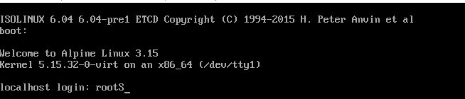
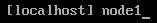
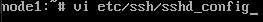
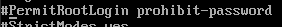
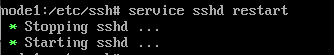
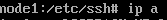
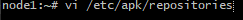
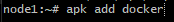
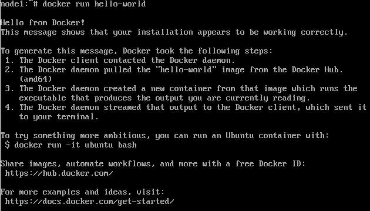

# Alphine-con-Docker

## Instalación de alphine

Bienvenidos, hoy vamos a crear una máquina virtual llamada alphine e instalar docker en ella para la gestión y creación de contenedores

1. Descargar la ISO

Lo primero sera ir a la página de [alphine](https://alpinelinux.org/downloads/) y descargar la iso de du preferencia y que se adapte a su dispositivo, nostros descargaremos la iso para máquinas virtuales("virtual") concretamente la versión de 64 bits.
 

2.Configuración de la instalación

Antes que nada he decido saltarme el paso de la creación de la máquina virtual y si no sabeis en mi repositorio tengo uno de como crear una máquina virtual, dicho esto las especificaciones serán

+ 4096Mb de ram
+ 10Gb de disco duro

Después de haberla creado he iniciarla debemos iniciar com usuario root, este no necesita contraseña
 

Para empezar con la instalación de alphine debemos ejecutar el comando `setup-alphine`
 

Y una vez echo esto debemos seguir unos pasos para tener una máquina totalmente funcional(los pasos que no explico los dejo en modo por defecto)

+ Decidir el nombre de la máquina
 

+ Decidir tu zona horaria 

 

 
+ Que disco duro vamos a usar

 

 
 
  
+ Importante elminar toda la memória del disco

 

 

3.Configuración del ssh

Lo siguiente és configurar el ssh para poder acceder a esta máquina desde nuestra máquina real.
Para ello vamos a entrar a este archivo y descomentar(quitar la almohadilla) la siguiente linea
 

 

 

I descomentar el todas la lineas

- Reiniciar el servicio ssh

 

-Descubrir nuestra ip(acordaos que la máquina tiene que estar configurada en modo adaptador puente en el apartado de red)

 

 

Una vez que ya sabemos cual es nuetra ip nosotros nos conectaremos desde la herramienta git bash

 

 

una vez en git bash entramos en este archivo y descomentamos todas la lineas

 

Y una vez en git bash o tu editor preferido tenemos instalar osando solo un comando

 

Por última hacemos un hacemos un `service docker start` después un pull sobre la imagen "hello-world" y un `docker run hello-world` y si se te sale este
mensaje significa que has istalado docker de forma correcta 

 

